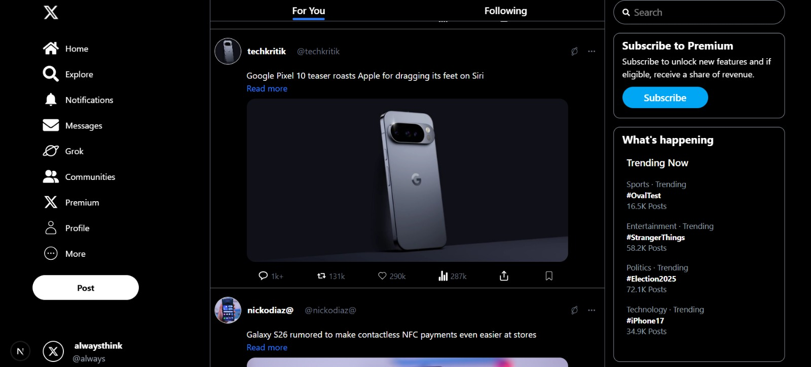
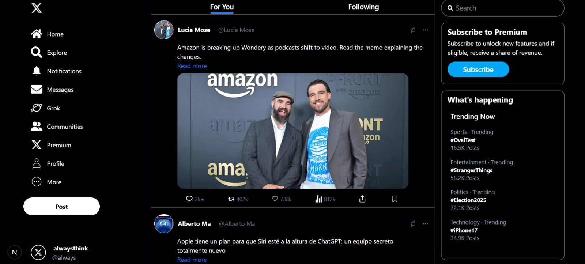

# X-Clone 🐦

A responsive clone of the X (formerly Twitter) platform built with modern web technologies.

## 🚀 Features

- ✅ **Mobile Responsive** – Works beautifully across all screen sizes.
- 🔄 **Fetch API Integration** – Posts are generated dynamically using Fetch API.
- ✨ Clean and intuitive UI.
- ⚡ Fast performance with smooth interactions.


## 🖼️ Screenshots

| Desktop View | Mobile View |
|--------------|-------------|
|  |  |
|  |  |


## 🛠️ Tech Stack

- **Next.js** (or React.js – whichever you're using)
- **Tailwind CSS** for styling
- **Fetch API** for dynamic post generation
- **React Icons** for UI elements

## 📂 Folder Structure
```
project-root/
│
├── components/ # Reusable components
├── pages/ # App routes and logic
├── public/ # Static assets
├── styles/ # Tailwind and global CSS
└── README.md
```

## 📦 Getting Started

1. **Clone the repository**
```bash
git clone https://github.com/your-username/x-clone.git
cd x-clone
```
2. **Install dependencies**
```bash
npm install
```
3. **Run the development server**
```bash
npm run dev
```
## 🌐 Live Demo
🔗 View Live Demo
